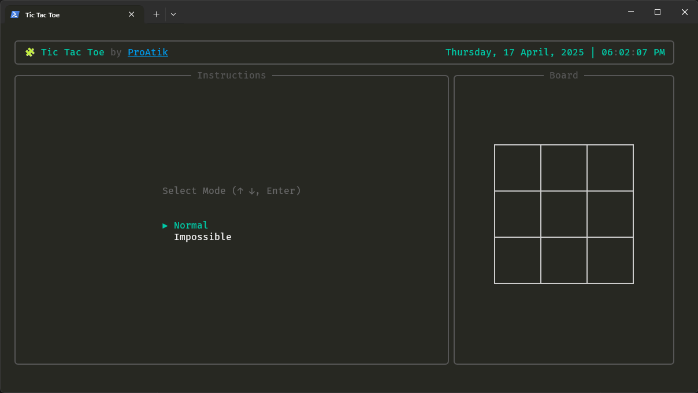
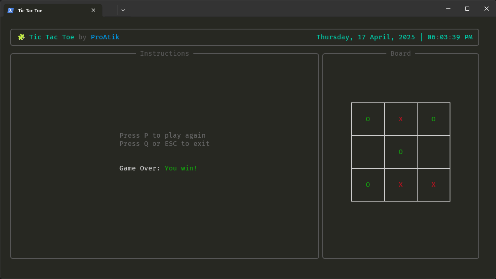

# 🎮 Tic Tac Toe - Terminal Edition

A fun and interactive terminal-based **Tic Tac Toe** game built with Python. Choose between two AI difficulty levels.

## 🔧 Prerequisites

- Python `3.12.x` or higher
- `pip` (Python package installer)

## ✨ Features

- 🤖 Two AI difficulty modes: **Normal** & **Impossible**
- 🎨 Modern terminal interface with [`rich`](https://rich.readthedocs.io/en/latest/) library
- ⌨️ Intuitive keyboard controls for seamless gameplay

## 📸 Screenshots




## 🚀 How to Run Locally

### 1. Clone the repository

```bash
git clone https://github.com/proatik/tic-tac-toe-terminal.git
cd tic-tac-toe-terminal
```

### 2. Create a virtual environment (optional but recommended)

```bash
python -m venv venv
source venv/bin/activate  # On Windows: venv\Scripts\activate
```

### 3. Install the dependencies

```bash
pip install -r requirements.txt
```

### 4. Run the game

```bash
python main.py
```

For Windows users, a standalone executable is available:
No Python installation required for the executable version. Here is the [`executable file`](windows/tic-tac-toe.exe)

## 🕹️ Controls

- `↑`: Move up
- `↓`: Move down
- `←`: Move left
- `→`: Move right
- `O` or `Space`: Place your mark (O)
- `Q` or `Esc`: Quit the game
- `P`: Play again after game ends
- `Enter`: Select game mode

## 🧠 AI Difficulty Modes

- **Normal Mode**: Slightly challenging, uses some basic tactics.
- **Impossible Mode**: Unbeatable AI powered by the `minimax` algorithm.

## 🧑‍💻 Author

Built with ❤️ by [ProAtik](https://www.linkedin.com/in/proatik)

## 📜 License

This project is open-source and available under the [MIT License](LICENSE).
